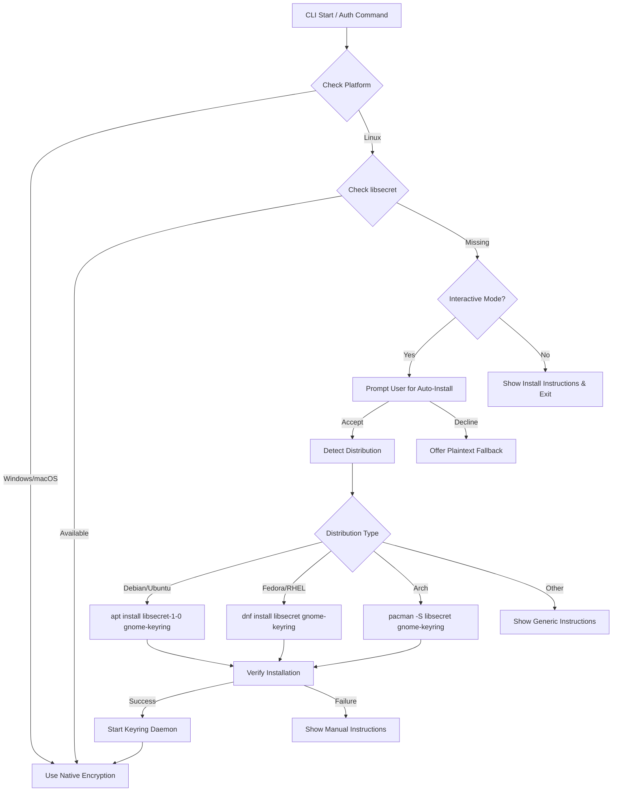

---
hide:
  - navigation
  #- toc
---

# Troubleshooting

This page contains common issues and their solutions when using the Fabric CLI.

## Encrypted cache error

| Issue | `[AuthenticationFailed] Encrypted cache error` on first launch |
|-------|----------------------------------------------------------------|
| **Cause** | System cannot securely encrypt authentication tokens (missing encryption libraries, containerized environment, security policies, or dependency issues) |
| **Solution** | Enable plaintext fallback: `fab config set encryption_fallback_enabled true` |
| **Security Note** | Tokens stored unencrypted in `~/.config/fab/cache.bin` - use caution on shared systems |

### Linux: Installing libsecret for encrypted token storage

On Linux, the Fabric CLI uses `libsecret` to securely store MSAL tokens via the GNOME Keyring or other Secret Service API implementations. If `libsecret` is not installed, you will encounter the encrypted cache error above.

#### Installation by distribution

=== "Ubuntu / Debian"

    ```bash
    sudo apt update
    sudo apt install -y libsecret-1-0 libsecret-1-dev gnome-keyring
    ```

=== "Fedora / RHEL / CentOS"

    ```bash
    sudo dnf install -y libsecret libsecret-devel gnome-keyring
    ```

=== "Arch Linux"

    ```bash
    sudo pacman -S libsecret gnome-keyring
    ```

=== "openSUSE"

    ```bash
    sudo zypper install libsecret-1-0 libsecret-devel gnome-keyring
    ```

=== "Alpine Linux"

    ```bash
    apk add libsecret gnome-keyring
    ```

#### Starting the keyring service

After installation, ensure the GNOME Keyring daemon is running:

```bash
# Start the keyring daemon (add to your shell profile for persistence)
eval "$(gnome-keyring-daemon --start --components=secrets)"
export GNOME_KEYRING_CONTROL
```

!!! tip "Desktop environments"
    If you're using a GNOME-based desktop environment (e.g., GNOME, Unity, Budgie), the keyring service is typically started automatically at login.

!!! tip "Headless/Server environments"
    For headless or server environments where no desktop session is available, consider using the plaintext fallback option (`fab config set encryption_fallback_enabled true`) or setting up D-Bus and the keyring daemon programmatically.

#### Verifying the installation

To verify that `libsecret` is correctly installed and the keyring is available:

```bash
# Check if libsecret is installed
pkg-config --modversion libsecret-1

# Check if the keyring daemon is running
pgrep -a gnome-keyring
```

#### Common issues

| Issue | Solution |
|-------|----------|
| `Cannot autolaunch D-Bus without X11 $DISPLAY` | Set up a D-Bus session manually: `eval "$(dbus-launch --sh-syntax)"` |
| Keyring prompts for password repeatedly | Ensure your session keyring is unlocked at login, or use the login keyring |
| Docker/Container environments | Use plaintext fallback or mount a keyring socket from the host |

### Architecture: Future CLI Automation for Dependency Installation

This section outlines the architecture for a potential future feature that would allow the Fabric CLI to automatically detect and guide users through installing missing dependencies like `libsecret` on Linux.

#### Proposed design



#### Implementation components

| Component | Description | Location |
|-----------|-------------|----------|
| `DependencyChecker` | Detects missing system dependencies on Linux | `src/fabric_cli/core/dependency_checker.py` |
| `DistroDetector` | Identifies Linux distribution family | `src/fabric_cli/core/distro_detector.py` |
| `PackageInstaller` | Executes package manager commands with user consent | `src/fabric_cli/core/package_installer.py` |
| `KeyringManager` | Manages keyring daemon lifecycle | `src/fabric_cli/core/keyring_manager.py` |

#### Detection strategy

1. **Check for libsecret**: Attempt to import `gi.repository.Secret` or check for `libsecret.so` in library paths
2. **Check for keyring daemon**: Query D-Bus for `org.freedesktop.secrets` service
3. **Detect distribution**: Parse `/etc/os-release` for `ID` and `ID_LIKE` fields

#### Example detection code (reference implementation)

```python
import os
import shutil
import subprocess
from typing import Optional, Tuple

def detect_linux_distro() -> Tuple[str, str]:
    """Detect Linux distribution family and name."""
    os_release = {}
    if os.path.exists("/etc/os-release"):
        with open("/etc/os-release") as f:
            for line in f:
                if "=" in line:
                    key, value = line.strip().split("=", 1)
                    os_release[key] = value.strip('"')
    
    distro_id = os_release.get("ID", "unknown")
    distro_like = os_release.get("ID_LIKE", "")
    
    # Map to distribution family
    if distro_id in ("ubuntu", "debian", "linuxmint", "pop") or "debian" in distro_like:
        return "debian", distro_id
    elif distro_id in ("fedora", "rhel", "centos", "rocky", "alma") or "fedora" in distro_like:
        return "fedora", distro_id
    elif distro_id == "arch" or "arch" in distro_like:
        return "arch", distro_id
    elif distro_id in ("opensuse", "sles") or "suse" in distro_like:
        return "suse", distro_id
    elif distro_id == "alpine":
        return "alpine", distro_id
    return "unknown", distro_id

def check_libsecret_available() -> bool:
    """Check if libsecret is available on the system."""
    # Check if the library file exists
    lib_paths = ["/usr/lib", "/usr/lib64", "/usr/lib/x86_64-linux-gnu"]
    for path in lib_paths:
        if os.path.exists(os.path.join(path, "libsecret-1.so.0")):
            return True
    
    # Alternative: check with pkg-config
    if shutil.which("pkg-config"):
        result = subprocess.run(
            ["pkg-config", "--exists", "libsecret-1"],
            capture_output=True
        )
        return result.returncode == 0
    return False

def get_install_command(distro_family: str) -> Optional[str]:
    """Get the package installation command for the distribution."""
    commands = {
        "debian": "sudo apt update && sudo apt install -y libsecret-1-0 libsecret-1-dev gnome-keyring",
        "fedora": "sudo dnf install -y libsecret libsecret-devel gnome-keyring",
        "arch": "sudo pacman -S --noconfirm libsecret gnome-keyring",
        "suse": "sudo zypper install -y libsecret-1-0 libsecret-devel gnome-keyring",
        "alpine": "sudo apk add libsecret gnome-keyring",
    }
    return commands.get(distro_family)
```

#### Security considerations

- **User consent**: Always require explicit user consent before running package manager commands
- **Privilege escalation**: Use `sudo` only when necessary and inform the user
- **Verification**: Verify package signatures through the system package manager
- **Fallback**: Always provide a manual installation option and plaintext fallback

#### Configuration options

Future configuration settings to control automation behavior:

```bash
# Enable/disable automatic dependency installation prompts
fab config set auto_install_deps false

# Set preferred package manager (auto-detected by default)
fab config set preferred_package_manager apt
```
